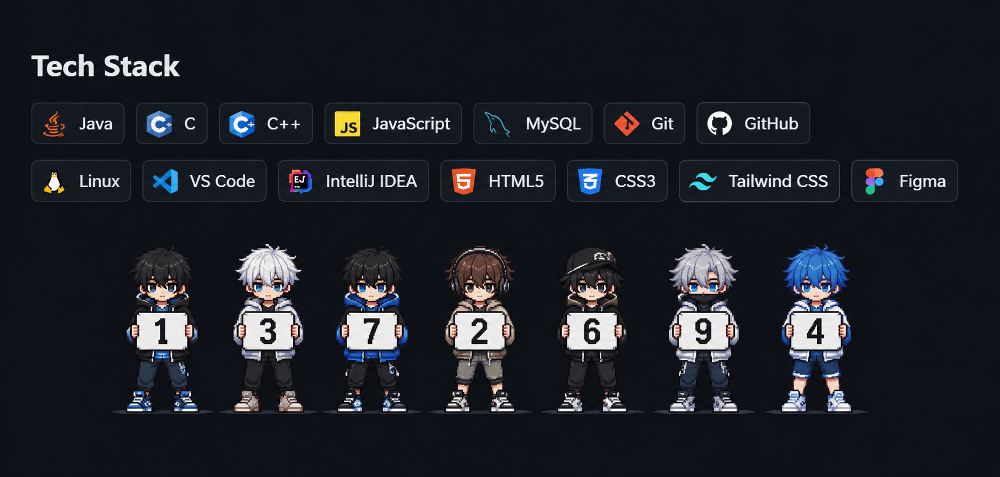

  

## ABOUT

> Information Science & Engineering student building with Java and strengthening Data Structures & Algorithms.
>
> Currently working on personal projects, hackathon ideas, and practical software implementations.
>
> Exploring problem solving, software development, and AI-driven applications.
>
> **SIH 2025 Grand Finalist**
## Socials

## Tech Stack

  
  
  
  

  
  
  
  

  
  
  
  

  
  

  

## GitHub Stats

  
  

  

  

  SOFTWARE ENGINEERING · ALGORITHMS · INTELLIGENT SYSTEMS

  

