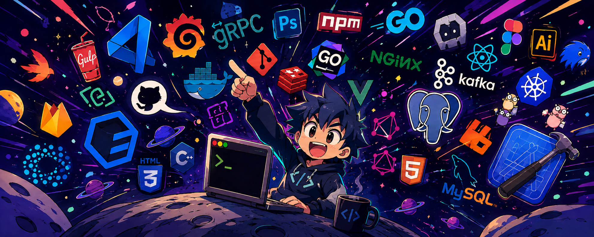

  

## ABOUT

  

  <b>Chethan Lakshman Bagi</b>
   
  Information Science & Engineering
    
  Java · Data Structures & Algorithms · Problem Solving
   
  Building, experimenting, and learning through real projects.
    
  SIH 2025 — GRAND FINALIST

## 🌐 Socials:

# 💻 Tech Stack:
    

# 📊 GitHub Stats:

  

  

  

  Software Engineering • Algorithms • Intelligent Systems

---
